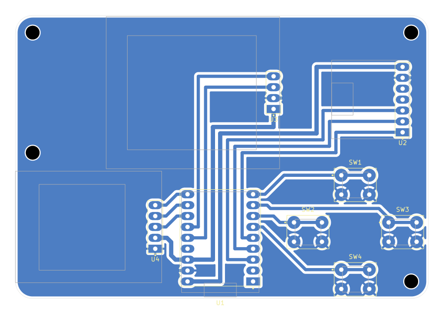

# Handheld Robo DJ

A pocket robot-voice DJ on an ESP32-S3. **SAM** (the 1982 Software Automatic Mouth speech synth) pre-renders a bank of
words into memory, and a "turntable deck" plays, scratches, stutters and reverses them over a drum machine, with a
16-step sequencer, granular and vocoder voice effects and a sci-fi HUD on a 128x128 OLED. Four buttons, one speaker.

The board is a single-sided PCB designed to be **milled on a desktop CNC** (all copper on the bottom, big pads, no
jumper wires). The modules plug into female headers, so there's no SMD soldering.



## What's in here

| Folder | Contents |
|---|---|
| `firmware/handheld_robodj/` | The Robo DJ sketch (Arduino), SAM's C core bundled alongside |
| `firmware/handheld_bringup/` | Bring-up / test sketch: I2C scan, buttons, joystick, OLED, beep. Flash this first |
| `hardware/kicad/` | KiCad project (schematic, PCB, custom symbols + footprints in `s3_cnc.pretty`) |
| `hardware/cnc/` | Gerbers + Excellon drills, ready-made G-code for a Genmitsu Cubiko (GRBL), the FlatCAM script, a 1:1 print for checking parts fit, and `CNC_CHEATSHEET.txt` |
| `docs/` | Board layout image |

## Parts

| Ref | Part | Notes |
|---|---|---|
| U1 | ESP32-S3 **SuperMini** | 2x 1x9 female headers. One with PSRAM (e.g. 4 MB flash / 2 MB PSRAM) holds the most words |
| U2 | MAX98357A I2S amp breakout | 1x7 female header, VIN on 5 V, plus a small 4-8 ohm speaker |
| U3 | 1.5" 128x128 OLED, **SH1107**, I2C | 1x4 female header (VCC GND SCL SDA), e.g. GME128128-01-IIC |
| U4 | KY-023 joystick module | 1x5 female header. Swap its right-angle pins for straight ones. Not used by Robo DJ, the bring-up sketch tests it |
| SW1-SW4 | 6 mm tact buttons | the diamond: UP / LEFT / RIGHT / DOWN |
| | 100 x 70 mm single-sided copper clad | board is 96 x 66 mm, M3 holes |

## Pinout

| Function | GPIO |
|---|---|
| OLED SDA / SCL | 11 / 12 |
| Amp DIN / BCLK / LRC | 1 / 2 / 3 |
| Buttons UP / RIGHT / LEFT / DOWN | 7 / 6 / 5 / 4 (to GND, internal pull-ups) |
| Joystick X / Y / SW | 10 / 9 / 8 (on 3V3) |

## Build the firmware

1. Arduino IDE (or arduino-cli) with the **ESP32 core 3.x** and the **U8g2** library.
2. Board settings: **ESP32S3 Dev Module**, **USB CDC On Boot: Enabled**, **PSRAM: QSPI PSRAM** (it runs without PSRAM, with fewer words).
   arduino-cli FQBN: `esp32:esp32:esp32s3:CDCOnBoot=cdc,PSRAM=enabled`
3. Open `firmware/handheld_robodj/handheld_robodj.ino` and upload. Flash `handheld_bringup` first if you're bringing up a fresh board.

```
arduino-cli compile --fqbn esp32:esp32:esp32s3:CDCOnBoot=cdc,PSRAM=enabled firmware/handheld_robodj
arduino-cli upload  --fqbn esp32:esp32:esp32s3:CDCOnBoot=cdc,PSRAM=enabled -p COMx firmware/handheld_robodj
```

Tips:
- The OLED uses the `U8G2_SH1107_PIMORONI_128X128` constructor. The generic SH1107 one shifts the picture by 32 px.
- If the SuperMini sits silent after an upload, press its RST button. The auto-reset can leave it in the bootloader.
- Intermittent buttons on a milled board usually turn out to be a solder bridge between neighbouring 2.54 mm pads.
- `handheld_bringup` prints to Serial every 250 ms: run it with a serial monitor open.

## Controls

Diamond: **UP = SHIFT**, **LEFT = VOICE**, **RIGHT = BEAT**, **DOWN = FX**. Live hits play instantly. With REC on they're quantized into the 16 steps.

| Button | tap | double | triple | hold |
|---|---|---|---|---|
| VOICE | say the word | next word | random word | SCRATCH it (tempo-synced) |
| BEAT | kick | snare | clap | hi-hat roll |
| FX | next FX | GROOVE on/off | | STUTTER |
| SHIFT + VOICE | REC on/off | clear voice track | clear all | REVERSE |
| SHIFT + BEAT | next scratch style | tempo | chord progression | TAPE STOP |
| SHIFT + FX | volume | next robot voice (re-renders the words) | | |
| SHIFT alone | MUTATE (new words, same rhythm) | AUTO (random beat + words) | | UNDERWATER |

- **Voice FX:** CLEAN, CRUSH, ECHO, GRAIN (slow cloud of grains at mixed pitches), SWARM (dense detuned robot choir), VOX (16-band vocoder on a chord, words stay clear), CHOIR (pure vocoder).
- **Scratch styles:** BABY, CHIRP, TRANSFORM, TEAR, FLARE.
- **Robot voices:** ROBOT, SAM, ELF, E.T., STUFFY, OLD LADY.
- **Words:** HELLO, ROBOT, YEAH, ERROR, DANCE, BEEP, BOOP, SYSTEM, ONLINE, WOW, FRESH, SCRATCH, ONE-FOUR, OH NO, COMPUTER, PARTY, FUNKY, AWESOME, DOES NOT COMPUTE. Edit `bank[]` in the sketch to make it say anything.

## Make the board

The PCB is single-sided with all copper on **B.Cu**, made for isolation milling. The Gerbers in `hardware/cnc/` also work at
a board house as a 1-layer board.

Milling order (details in `hardware/cnc/CNC_CHEATSHEET.txt`): 0.1 mm 20° V-bit isolation, 1.0 mm drill, 2.0 mm drill,
then V-bit outline score. The `.nc` files are ready to run on a GRBL machine. The drill files are already patched by
`fix_drill_spinup.py`, which fixes the spindle start for GRBL laser mode. To regenerate with FlatCAM, set the
path at the top of `load_and_mirror.tcl` and run it (File > Scripting > Run Script). It mirrors the board, because the
copper is on the bottom.

Before milling, print `PRINT_1to1_fit_test.pdf` at 100% and check your modules against it. The OLED and joystick
outlines were measured from photos.

## Credits and license

- **SAM** (Software Automatic Mouth) by Mark Barton / Don't Ask Software (1982). C port by Sebastian Macke,
  ESP8266SAM by Earle F. Philhower III. The C core is bundled in `firmware/handheld_robodj/`.
- **U8g2** by olikraus; **esp-dsp** and the ESP32 Arduino core by Espressif.
- Co-created by **Mark Hellar** and **Claude** (Anthropic). PCB milled and soldered by Mark Hellar.

Licensed under the **GNU GPL v3** (see `LICENSE`), the same as the bundled SAM core.
